<h1 align="center">Bob Robert</h1>

de Montfort LLC. I build products, and the zero-dependency, zero-AI developer tools that ship them.

  
  

## Products

- [TachyonTracker](https://tachyontracker.com): contractor compliance and COI verification in seconds instead of days.
- [COI Validator API](https://coivalidator.com): a standalone certificate-of-insurance validation API.
- [gradeAfoods](https://gradeafoods.com): food-industry tooling.

## The toolbelt

A set of command-line tools with no dependencies, no AI at runtime, MIT-licensed, tested on Node 18, 20 and 22 across Linux, macOS and Windows. Each one runs with `npx`.

<table>
  <tr>
    <td valign="top" width="50%">
      <h3><a href="https://github.com/bobfromarcher/gitpulse">gitpulse</a></h3>
      
A one-screen health report for any git repo: commit activity, hot files, contributors, language mix and TODO markers.

      
<code>npx @bobfromarcher/gitpulse</code>

    </td>
    <td valign="top" width="50%">
      <h3><a href="https://github.com/bobfromarcher/envdoc">envdoc</a></h3>
      
Find every env var your code reads, then document it. Generates <code>.env.example</code> and fails CI on undocumented vars.

      
<code>npx @bobfromarcher/envdoc</code>

    </td>
  </tr>
  <tr>
    <td valign="top" width="50%">
      <h3><a href="https://github.com/bobfromarcher/portkill">portkill</a></h3>
      
Find and kill whatever is holding a TCP port. Cross-platform. The fix for <code>EADDRINUSE</code>.

      
<code>npx @bobfromarcher/portkill 3000</code>

    </td>
    <td valign="top" width="50%">
      <h3><a href="https://github.com/bobfromarcher/chlog">chlog</a></h3>
      
Generate a Keep-a-Changelog <code>CHANGELOG.md</code> from your conventional commits and git tags.

      
<code>npx @bobfromarcher/chlog --write</code>

    </td>
  </tr>
  <tr>
    <td valign="top" width="50%">
      <h3><a href="https://github.com/bobfromarcher/gitsweep">gitsweep</a></h3>
      
Find and prune stale local branches that are merged or remote-gone, never the ones you still need.

      
<code>npx @bobfromarcher/gitsweep</code>

    </td>
    <td valign="top" width="50%">
      <h3><a href="https://github.com/bobfromarcher/licsweep">licsweep</a></h3>
      
Audit your dependency licenses. Flag copyleft and unknown, and fail CI on a deny-list.

      
<code>npx @bobfromarcher/licsweep --check</code>

    </td>
  </tr>
  <tr>
    <td valign="top" width="50%">
      <h3><a href="https://github.com/bobfromarcher/leaksweep">leaksweep</a></h3>
      
Scan code for committed secrets: API keys, tokens, private keys, high-entropy strings. Pre-commit hook and CI gate.

      
<code>npx @bobfromarcher/leaksweep --staged</code>

    </td>
    <td valign="top" width="50%">
      <h3><a href="https://github.com/bobfromarcher/ghcard">ghcard</a></h3>
      
Generate self-contained SVG stat cards and a profile README from any GitHub account. No third-party image services.

      
<code>npx @bobfromarcher/ghcard you --readme</code>

    </td>
  </tr>
</table>

The cards at the top were rendered by ghcard. This page is a self-contained build with no external requests.

gitsweep, licsweep and leaksweep share one idea: keep the repo clean before it bites you. They sweep stale branches, risky licenses and committed secrets.

## Other open source

- [LocoPilot](https://github.com/bobfromarcher/LocoPilot): vision, browser and desktop control for any local LLM. 35 endpoints, zero cloud, one file.

## How these tools are built

- Zero dependencies. Each tool is a single Node file with no `node_modules`. Nothing to audit, nothing to break.
- Zero AI at runtime. Deterministic, offline and fast, so they help humans and AI agents alike.
- One job each, with a clear output and `--json` everywhere for scripting.

## Links

[TachyonTracker](https://tachyontracker.com), [COI Validator](https://coivalidator.com), [gradeAfoods](https://gradeafoods.com)

Profile generated by <a href="https://github.com/bobfromarcher/ghcard">ghcard</a>. No third-party services, just SVG.

